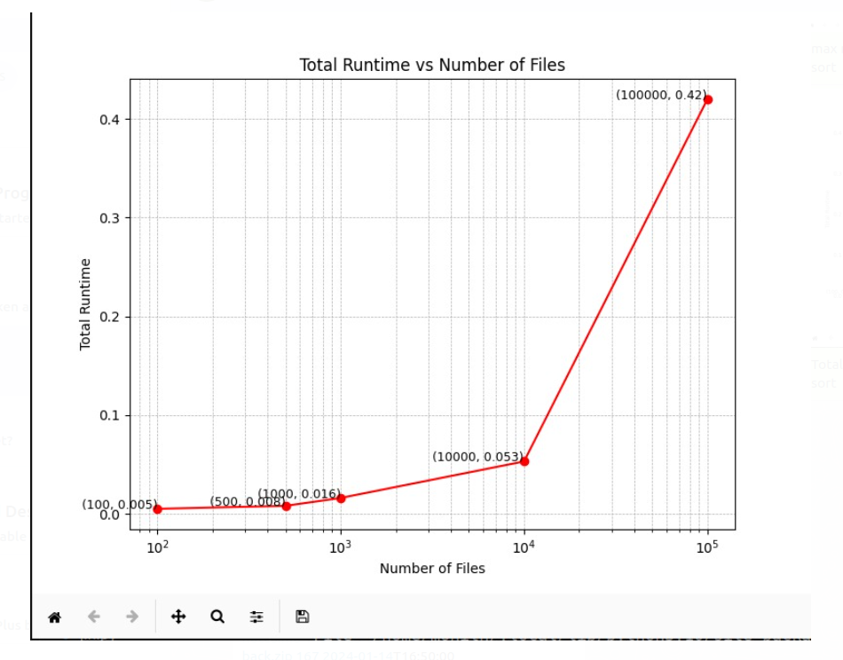
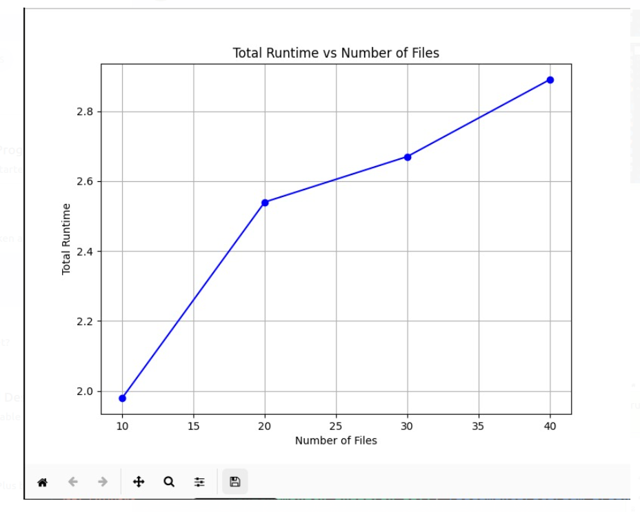
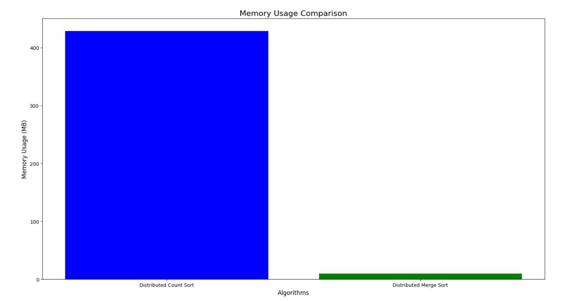
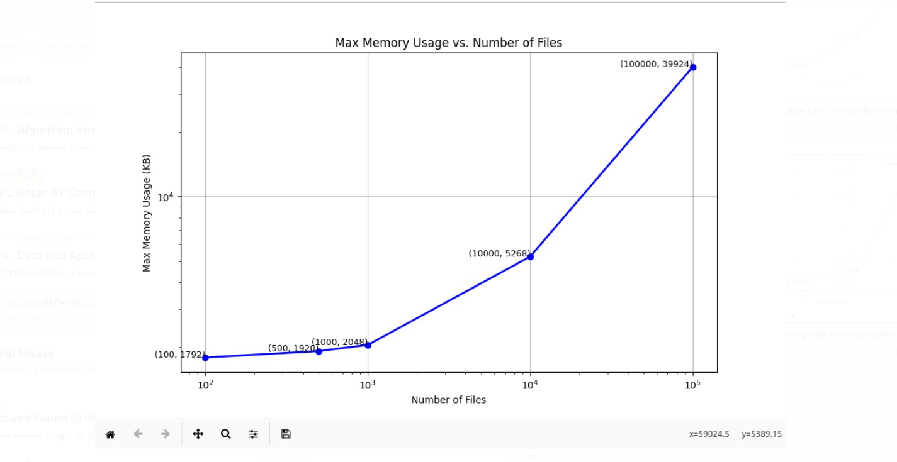
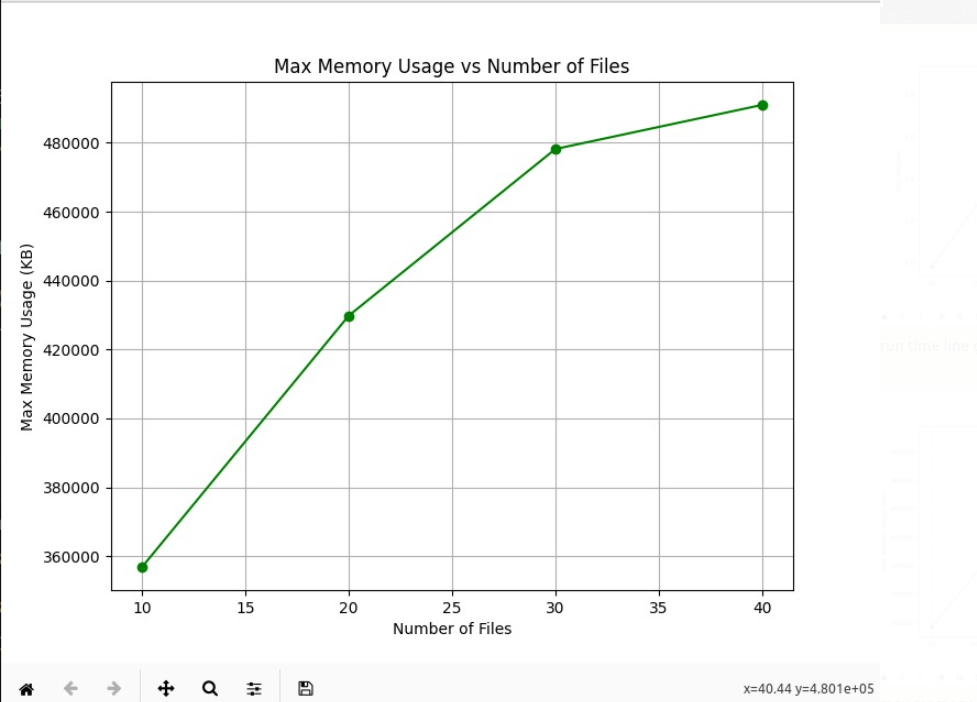

# LAZY File Management System - Concurrency Project

## Overview

The LAZY File Management System is a comprehensive concurrency project consisting of two main components:
1. **LAZY_READ_WRITE**: A real-time file access simulation system with concurrency control
2. **LAZY_SORT**: A distributed sorting algorithm that dynamically chooses between sorting strategies

## Project Structure

```
Concurrency/
├── lazy_read_write.c     # File access simulation with threading
├── lazy_sort.c           # Distributed sorting implementation
├── README.md            # This documentation
└── images/              # Performance analysis graphs
    ├── image.png
    ├── image-1.png
    ├── image-2.png
    ├── image-3.png
    └── image-4.png
```

## Component 1: LAZY_READ_WRITE

### Description
A real-time simulation of a file manager that handles concurrent user requests for reading, writing, and deleting files. The system uses pthread synchronization primitives to manage concurrency and user patience limits.

### Features
- **Real-time simulation** using threads and condition variables
- **Concurrent access control** with configurable limits
- **User patience modeling** with timeout cancellations
- **Color-coded output** for different events
- **Thread-safe file operations** with proper synchronization

### Input Format
```
r w d          # Time for READ, WRITE, DELETE operations (seconds)
n c T          # Number of files, max concurrent users, timeout (seconds)
u_1 f_1 o_1 t_1   # User requests: user_id file_id operation time
...
STOP           # End of input
```

### Concurrency Rules
- **READ**: Multiple users can read simultaneously, even during writes
- **WRITE**: Only one user can write at a time
- **DELETE**: Only when no active reads/writes; permanently removes file
- **Timeout**: Users cancel if LAZY doesn't respond within T seconds

### Compilation & Execution
```bash
gcc -o lazy_read_write lazy_read_write.c -lpthread
./lazy_read_write
```

### Example Usage
```
3 2 1          # READ=3s, WRITE=2s, DELETE=1s
2 2 5          # 2 files, max 2 concurrent users, 5s timeout
1 1 READ 0     # User 1 reads file 1 at time 0
2 1 WRITE 1    # User 2 writes file 1 at time 1
STOP
```

## Component 2: LAZY_SORT

### Description
A distributed sorting system that dynamically chooses between Count Sort and Merge Sort based on dataset size. Uses parallel processing with configurable thread pools.

### Features
- **Dynamic algorithm selection** based on threshold (42 files)
- **Distributed Count Sort** for small datasets (< 42 files)
- **Distributed Merge Sort** for large datasets (≥ 42 files)
- **Multi-threaded implementation** with 4 worker threads
- **Multiple sorting criteria** (Name, ID, Timestamp)

### Algorithms

#### Distributed Count Sort (< 42 files)
- Parallel counting phase with thread-local arrays
- Global aggregation of counts
- Stable sorting with linear time complexity
- Memory-intensive but efficient for small datasets

#### Distributed Merge Sort (≥ 42 files)
- Parallel divide-and-conquer approach
- Thread-based chunk sorting
- Sequential merging of sorted chunks
- Optimal for large datasets with controlled memory usage

### Input Format
```
n                    # Number of files
name_1 id_1 timestamp_1
name_2 id_2 timestamp_2
...
SortBy              # "Name", "ID", or "Timestamp"
```

### Compilation & Execution
```bash
gcc -o lazy_sort lazy_sort.c -lpthread
./lazy_sort
```

### Example Usage
```
3
file1.txt 101 2023-01-15T10:30:00
file2.txt 102 2023-01-14T09:15:00
file3.txt 100 2023-01-16T11:45:00
ID
```

## Technical Implementation

### Synchronization Primitives
- **pthread_mutex_t**: File-level locking
- **pthread_cond_t**: Condition variables for READ/WRITE/DELETE coordination
- **pthread_t**: Thread management for concurrent operations

### Thread Management
- **Fixed thread pool**: 4 worker threads for optimal performance
- **Work distribution**: Even chunk allocation across threads
- **Load balancing**: Dynamic work distribution based on dataset characteristics

### Key Data Structures 

```c
typedef struct {
    char name[MAX_FILENAME_LEN];
    int id;
    char timestamp[MAX_TIMESTAMP_LEN];
    int timehash;
    int nhash;
} File; # for lazy_sort

typedef struct {
    int access_count;
    int write_flag;
    int delete_flag;
    pthread_mutex_t lock;
    pthread_cond_t read;
    pthread_cond_t write;
    pthread_cond_t delete;
} FileStatus; #for lazy_read_write
```

## Building and Testing

### Compilation
```bash
# Compile both components
gcc -o lazy_read_write lazy_read_write.c -lpthread -std=c99
gcc -o lazy_sort lazy_sort.c -lpthread -std=c99

### Testing
```bash
# Test file access simulation
echo "3 2 1
2 2 5
1 1 READ 0
2 1 WRITE 1
STOP" | ./lazy_read_write

# Test sorting system
echo "3
file1.txt 101 2023-01-15T10:30:00
file2.txt 102 2023-01-14T09:15:00
file3.txt 100 2023-01-16T11:45:00
ID" | ./lazy_sort
```

## Design Decisions

### Why This Architecture?
1. **Modular Design**: Separate components for different functionalities
2. **Scalable Threading**: Fixed thread pool prevents resource exhaustion
3. **Dynamic Algorithm Selection**: Optimal performance across dataset sizes
4. **Real-time Simulation**: Accurate timing using system clocks

### Performance Optimizations
1. **Thread-local Counting**: Reduces contention in count sort
2. **Efficient Merging**: Minimizes data movement in merge sort
3. **Condition Variables**: Efficient blocking/signaling for file access
4. **Memory Management**: Careful allocation/deallocation to prevent leaks

## Conclusion

The LAZY File Management System demonstrates advanced concurrency concepts including:
- Multi-threaded programming with pthreads
- Synchronization using mutexes and condition variables
- Distributed algorithm design and implementation
- Real-time system simulation
- Performance analysis and optimization

This project showcases practical applications of operating system concepts in building efficient, concurrent file management systems.


# Distributed Sorting - System Performance Analysis
## 1.Implementation Analysis :

### 1. **Task Distribution for Parallel Sorting (Count Sort and Merge Sort)**

#### Count Sort(Parallel):
- Divides the input into equal chunks for each thread, with each thread handling its portion of the count array. After processing, threads combine the counts into a global array.
  - **Pros**: 
    - Scalable and efficient for large datasets.
    - Independent tasks for each thread.
  - **Cons**: 
    - High overhead in thread creation.
    - Memory usage for count arrays.

#### Merge Sort (Parallel):
- Each thread sorts a portion of the array, and after sorting, subarrays are merged. The final merge step ensures all subarrays are combined correctly.
  - **Pros**:
    - Efficient parallelization as threads can independently sort chunks.
  - **Cons**: 
    - Merging can become a bottleneck.
    - Sequential process for merging, leading to diminishing returns on very large datasets.

### 2. **Task Distribution for Merge Sort (Distributed)**

- **Divide and Conquer**: The array is split into chunks, sorted by different nodes, and then merged across all nodes.
  - **Pros**: 
    - Ideal for distributed environments with separate machines.
  - **Cons**: 
    - Communication overhead during merging can reduce speed.

### 3. **Why This Approach?**
- **Parallel Sorting**: Using multiple threads to handle different chunks helps leverage multiple cores, speeding up sorting for large datasets.
- **Distributed Sorting**: When data exceeds local memory or for very large datasets, distributing tasks across multiple systems can handle data efficiently.

### 4. **Optimization Considerations**
- **Thread Creation Overhead**: Multiple threads can introduce overhead due to context switching and synchronization.
- **Workload Imbalance**: Unevenly sized chunks might lead to some threads being idle while others are still working.

### Conclusion
- **Parallel Count Sort**: Suitable when data is not too large and can be handled with multiple threads within one system.
- **Parallel Merge Sort**: Best for large datasets, especially when sorting must be done in parts.
- **Distributed Approach**: Useful when data can be distributed across multiple machines, but merging and communication are key challenges.


## 2. Execution Time Analysis :

To assess scalability, we measured execution times for both Distributed Count Sort and Distributed Merge Sort across varying file counts (small, medium, large). Below are the results:

### Distributed Merge Sort
- **Small File Count (100 files)**: Completion time is **0.005 seconds**.
- **Medium File Count (500 files)**: Completion time rises to **0.008 seconds**.
- **Large File Count (1,000 files)**: Sorting completes in **0.016 seconds**.
- **Very Large File Count (10,000 files)**: Processing time extends to **0.053 seconds**.
- **Extremely Large File Count (100,000 files)**: Processing time reaches **0.42 seconds**.

### Distributed Count Sort
- **Small File Count (10 files)**: Sorting takes **1.98 seconds**.
- **Medium File Count (20 files)**: Time increases to **2.54 seconds**.
- **Large File Count (30 files)**: Sorting completes in **2.67 seconds**.
- **Very Large File Count (40 files)**: Processing extends to **2.89 seconds**.

---

## 3. Memory Usage Overview :

A high-level view of memory consumption shows distinct patterns for each algorithm based on file counts:

### Distributed Count Sort
- **Small Datasets (File Count 10–40)**:
  - Memory usage starts at **356864 KB** (10 files) and scales to **491008 KB** (40 files).

### Distributed Merge Sort
- **Small Datasets (File Count 10–40)**:
  - Memory usage ranges from **1664 KB** (10 files) to **1792 KB** (40 files), driven by recursion depth and temporary arrays needed for merging operations.

## 4. Graphs :

#### 1. Simple line graph for execution time of Distributed Merge Sort across different no of files



#### 2. Simple line graph for execution time of Distributed Count Sort across different no of files



#### 3. Bar graph for comparision of memory usage in (MB) for Distributed Count Sort vs Distributed Merge Sort across average number of files for both the Distributed sorting algorithms



#### 4. Simple line graph for Max Memory Usage in (KB) of Distributed Merge Sort across different no of files



#### 5. Simple line graph for Max Memory Usage in (KB) of Distributed Merge Sort across different no of files



## 5. Summary:

In analyzing parallel and distributed sorting methods, we evaluated the performance of Distributed Count Sort and Distributed Merge Sort across various dataset sizes. Here’s a summary of the key findings:

### Distributed Merge Sort:

- **Efficient Scaling**: This method handled increasing file counts effectively, showing minimal time increments as the file count scaled.
- **Performance**: Execution times for smaller file counts (100–10,000 files) remained below 0.1 seconds, while even extremely large datasets (100,000 files) only required 0.42 seconds.
- **Memory Use**: Relatively low memory usage, making it suitable for larger datasets when sorting efficiency and memory constraints are essential.

### Distributed Count Sort:

- **Execution Time**: Showed consistent execution times for datasets up to 40 files but required 2+ seconds, indicating potential performance limits as dataset sizes grow.
- **Memory Overhead**: Required substantial memory, reaching 491,008 KB for 40 files, making it better suited for smaller datasets or instances where parallelization outweighs memory concerns.

### Optimization Potential:

- **Parallel Count Sort**: Reducing thread overhead and balancing load across threads could improve performance for larger datasets.
- **Distributed Merge Sort**: Optimizing the merging step or using more advanced distributed merging techniques could enhance its scalability for very large datasets, reducing potential bottlenecks.

### Conclusion:

- **Distributed Merge Sort**: Offers robust scalability for large datasets.
- **Distributed Count Sort**: Performs better with small datasets but may be less efficient for extensive data due to memory demands and thread management overhead.


